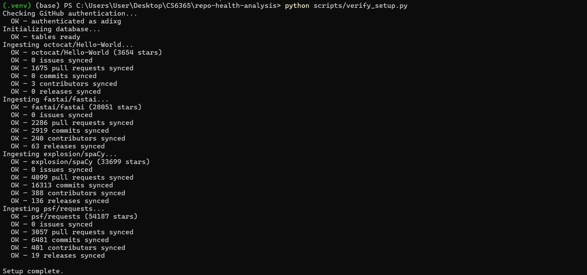
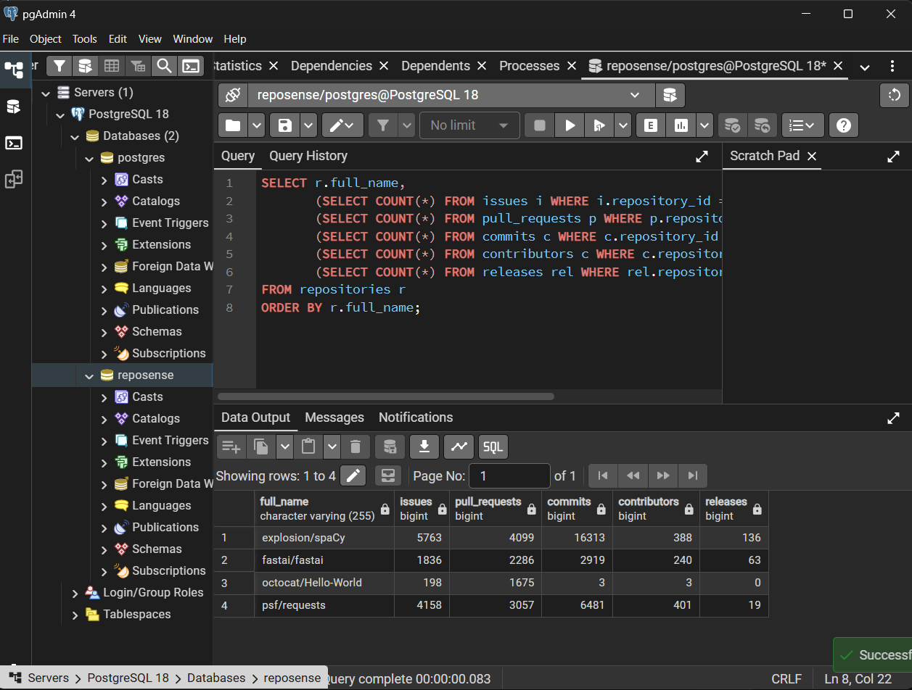
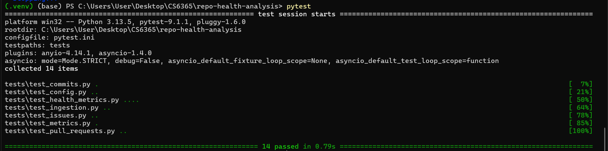

# Checkpoint 2 Evidence

This document records reproducible evidence for RepoSense Checkpoint 2: ingestion, PostgreSQL storage, analytics, and dashboard views on real public GitHub repositories.

**Date:** June 2026  
**Repositories evaluated:** `octocat/Hello-World`, `fastai/fastai`, `explosion/spaCy`, `psf/requests`

## How to reproduce

```powershell
cd repo-health-analysis
.venv\Scripts\Activate.ps1
python scripts/verify_setup.py
pytest
streamlit run src/dashboard/app.py
```

Ensure PostgreSQL is running and `.env` contains a valid `GITHUB_TOKEN` plus database credentials.

## 1. Setup script output

Command:

```powershell
python scripts/verify_setup.py
```

Screenshot:



Expected behavior:

* GitHub authentication succeeds
* Database tables are created or migrated
* Each configured repository is ingested
* Issues, pull requests, commits, contributors, and releases are synced per repository

## 2. PostgreSQL query evidence

Query run in pgAdmin against the `reposense` database:

```sql
SELECT
  r.full_name,
  (SELECT COUNT(*) FROM issues i WHERE i.repository_id = r.id) AS issues,
  (SELECT COUNT(*) FROM pull_requests p WHERE p.repository_id = r.id) AS pull_requests,
  (SELECT COUNT(*) FROM commits c WHERE c.repository_id = r.id) AS commits,
  (SELECT COUNT(*) FROM contributors c WHERE c.repository_id = r.id) AS contributors,
  (SELECT COUNT(*) FROM releases rel WHERE rel.repository_id = r.id) AS releases
FROM repositories r
ORDER BY r.full_name;
```

Screenshot:



Issue-count query used during early Checkpoint 2 validation:

```sql
SELECT r.full_name, COUNT(i.id) AS issue_count
FROM repositories r
LEFT JOIN issues i ON i.repository_id = r.id
GROUP BY r.full_name
ORDER BY issue_count DESC;
```

Recorded issue counts at time of initial capture:

| full_name | issue_count |
|-----------|------------:|
| explosion/spaCy | 5763 |
| psf/requests | 4158 |
| fastai/fastai | 1836 |
| octocat/Hello-World | 198 |

## 3. Dashboard output

Command:

```powershell
streamlit run src/dashboard/app.py
```

Dashboard evidence by tab:

| Tab | Artifact |
|-----|----------|
| Overview | [dashboard_output_overview.pdf](dashboard_output_overview.pdf) |
| Issues | [dashboard_output_issues.pdf](dashboard_output_issues.pdf) |
| Pull Requests | [dashboard_output_pull_requests.pdf](dashboard_output_pull_requests.pdf) |
| Commits | [dashboard_output_commits.pdf](dashboard_output_commits.pdf) |
| Contributors | [dashboard_output_contributors.pdf](dashboard_output_contributors.pdf) |
| Releases | [dashboard_output_releases.pdf](dashboard_output_releases.pdf) |
| Compare | [dashboard_output_compare.pdf](dashboard_output_compare.pdf) |

Combined dashboard export:

* [dashboard_output.pdf](dashboard_output.pdf)

The dashboard shows:

* repository overview and per-repo summary metrics
* issue health metrics (closure rate, stale issues, median resolution time, label distribution)
* pull-request merge rate
* commit activity and monthly commit trends
* contributor concentration and top contributors
* release frequency
* cross-repository comparison table

## 4. Automated tests

Command:

```powershell
pytest
```

Screenshot:



Expected result: all unit tests pass (config parsing, ingestion helpers, issue metrics, PR/commit/contributor/release metrics, label distribution).

## Checkpoint 2 coverage summary

| Requirement | Evidence |
|-------------|----------|
| Authenticated GitHub API access | verify script output |
| PostgreSQL schema + populated tables | PostgreSQL screenshot + SQL results |
| Multiple repository support | 4 repos in SQL results |
| Caching / incremental sync | `GitHubClient`, `ingest_issues()`, `ingest_commits()` |
| Repository metadata ingestion | verify script output |
| Issue ingestion + metrics | dashboard issues tab + `/metrics/issues` |
| Issue label distribution | dashboard issues tab + `/metrics/labels/{owner}/{repo}` |
| Pull-request ingestion + merge rate | dashboard pull requests tab + `/metrics/pull-requests` |
| Commit ingestion + activity metrics | dashboard commits tab + `/metrics/commits` |
| Contributor ingestion + concentration | dashboard contributors tab + `/metrics/contributors` |
| Release ingestion + frequency metrics | dashboard releases tab + `/metrics/releases` |
| Cross-repository comparison | dashboard compare tab + `/metrics/comparison` |
| Unit tests | `pytest` (15 tests) + `pytest_result.png` |

## Planned for Checkpoint 3

* MCP tool servers
* Ollama integration and semantic retrieval
* evidence-grounded chat in the dashboard
* exploratory cross-repository correlation analysis
* exportable health report
* full system containerization
