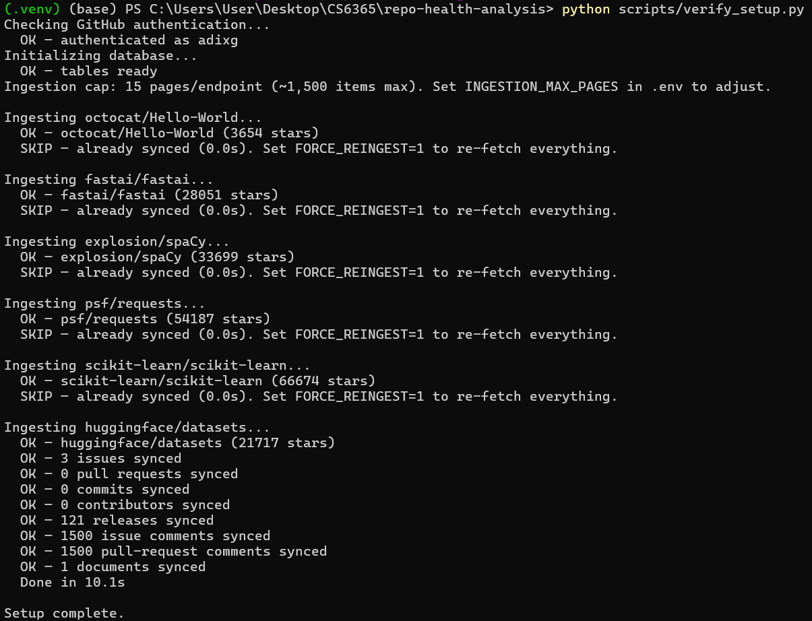
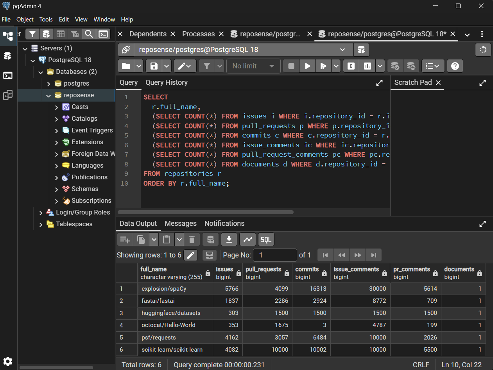
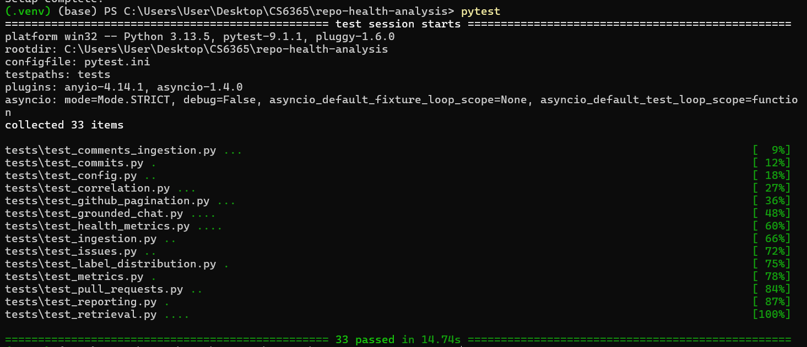

# Checkpoint 3 Evidence

This document records reproducible evidence for RepoSense Checkpoint 3: comments/doc ingestion, semantic retrieval, grounded Ollama chat, MCP tools, correlations, report export, and deployment on real public GitHub repositories.

**Date:** July 2026  
**Repositories evaluated:** `octocat/Hello-World`, `fastai/fastai`, `explosion/spaCy`, `psf/requests`, `scikit-learn/scikit-learn`, `huggingface/datasets`

---

## Where to save screenshots and files

**Put everything in the `docs/` folder** (same place as Checkpoint 2):

```
repo-health-analysis/
└── docs/
    ├── checkpoint3-evidence.md          ← this file
    ├── verify_script_output_cp3.png     ← you add
    ├── postgresql_output_cp3.png        ← you add
    ├── pytest_result_cp3.png            ← you add
    ├── dashboard_chat.png               ← you add
    ├── dashboard_correlations.png       ← you add
    ├── dashboard_reports.png            ← you add
    ├── health_report_psf__requests.md   ← optional export sample
    └── verified_questions_cp3.md        ← optional Q&A log
```

**Naming rules:**
- Use **PNG** for terminal/SQL/dashboard screenshots (`.png`)
- Use exact filenames above so this doc renders on GitHub
- No spaces in filenames (use underscores)
- After you drop files in `docs/`, this markdown will show them automatically — no paste into chat needed unless you want me to review

---

## Screenshot checklist (quick reference)

| # | What to capture | Filename | How |
|---|-----------------|----------|-----|
| 1 | `verify_setup.py` finishing on 6 repos | `verify_script_output_cp3.png` | Screenshot terminal after `Setup complete.` |
| 2 | PostgreSQL row counts (6 repos + comments) | `postgresql_output_cp3.png` | pgAdmin or psql query below |
| 3 | `pytest` — 32 passed | `pytest_result_cp3.png` | Screenshot terminal after `pytest` |
| 4 | Dashboard **Chat** tab with answer + evidence | `dashboard_chat.png` | Streamlit, expand evidence expander |
| 5 | Dashboard **Correlations** tab (6 repos) | `dashboard_correlations.png` | Streamlit bar chart visible |
| 6 | Dashboard **Reports** tab or downloaded `.md` | `dashboard_reports.png` | Preview or export button |
| 7 | *(Optional)* Ollama model list | `ollama_models.png` | `ollama list` in terminal |
| 8 | *(Optional)* API health/chat | `api_chat_response.png` | Browser or curl to `/chat` |

---

## How to reproduce

```powershell
cd C:\Users\User\Desktop\CS6365\repo-health-analysis
.\.venv\Scripts\Activate.ps1

# PostgreSQL running, Ollama running:
ollama serve
python scripts/verify_setup.py
pytest
streamlit run src/dashboard/app.py
```

Ensure `.env` contains:

```env
GITHUB_TOKEN=...
POSTGRES_USER=reposense
POSTGRES_PASSWORD=reposense
POSTGRES_DB=reposense
OLLAMA_BASE_URL=http://localhost:11434
OLLAMA_MODEL=qwen2.5:3b
INGESTION_MAX_PAGES=15
SAMPLE_REPOS=octocat/Hello-World,fastai/fastai,explosion/spaCy,psf/requests,scikit-learn/scikit-learn,huggingface/datasets
```

---

## 1. Setup script output

Command:

```powershell
python scripts/verify_setup.py
```

Screenshot:



Expected behavior:

* GitHub authentication succeeds
* Already-synced repos show `SKIP — already synced`
* New or incomplete repos ingest issues, PRs, commits, contributors, releases
* **Issue comments, PR comments, and documents** counts are printed
* Script ends with `Setup complete.`

---

## 2. PostgreSQL query evidence

Run in **pgAdmin** or **psql** against the `reposense` database:

```sql
SELECT
  r.full_name,
  (SELECT COUNT(*) FROM issues i WHERE i.repository_id = r.id) AS issues,
  (SELECT COUNT(*) FROM pull_requests p WHERE p.repository_id = r.id) AS pull_requests,
  (SELECT COUNT(*) FROM commits c WHERE c.repository_id = r.id) AS commits,
  (SELECT COUNT(*) FROM issue_comments ic WHERE ic.repository_id = r.id) AS issue_comments,
  (SELECT COUNT(*) FROM pull_request_comments pc WHERE pc.repository_id = r.id) AS pr_comments,
  (SELECT COUNT(*) FROM documents d WHERE d.repository_id = r.id) AS documents
FROM repositories r
ORDER BY r.full_name;
```

Screenshot:



Expected: **6 rows** in `repositories`, non-zero counts for most columns (exact numbers depend on `INGESTION_MAX_PAGES` cap).

---

## 3. Grounded chat (Dashboard)

Command:

```powershell
streamlit run src/dashboard/app.py
```

1. Select a repo (e.g. `psf/requests`)
2. Open the **Chat** tab
3. Ask: *What are common themes in open issues?*
4. Expand **Retrieved evidence** so citations are visible
5. Screenshot the full tab

Screenshot:


Expected behavior:

* Answer cites evidence by number (e.g. `[1]`, `[2]`)
* Evidence panel shows retrieved issue/comment/document chunks
* Precomputed metrics are used (not invented by the model)

---

## 4. Correlation analysis (Dashboard)

1. Open the **Correlations** tab
2. Confirm **6 repositories** are included (needs ≥2 repos; you have 6)
3. Screenshot the popularity correlation table and bar chart

Screenshot:


Caption to include in your report: correlations are **exploratory associations**, not causal claims.

---

## 5. Exportable health report (Dashboard)

1. Open the **Reports** tab
2. Click **Generate report preview**
3. Screenshot the rendered Markdown (Issue health, PRs, Contributors, Labels sections visible)

Screenshot:


Optional: click **Download Markdown report** and save a sample to `docs/health_report_psf__requests.md`.

---

## 6. Automated tests

Command:

```powershell
pytest
```

Screenshot:



Expected result: **32 tests passed**, including:

* `test_retrieval.py`
* `test_correlation.py`
* `test_comments_ingestion.py`
* `test_grounded_chat.py`
* `test_reporting.py`
* `test_github_pagination.py`

---

## 7. Verified questions (evaluation)

Full evaluation log: [verified_questions_cp3.md](verified_questions_cp3.md)

| # | Question | Repo | Expected (from metrics/DB) | System answer | Correct? | Evidence cited? |
|---|----------|------|---------------------------|---------------|----------|-----------------|
| 1 | How many stale open issues (>90d)? | psf/requests | 141 | Dashboard Issues tab: 141 | Yes | n/a |
| 2 | What is the issue closure rate? | fastai/fastai | 87.4% (0.874) | Dashboard Issues tab: 87% | Yes | n/a |
| 3 | Who is the top contributor? | explosion/spaCy | ines (32.6% share) | Contributors tab: ines | Yes | n/a |
| 4 | How many commits in the last 6 months? | scikit-learn/scikit-learn | 531 | Commits tab: 531 | Yes | n/a |
| 5 | What are the top issue labels? | psf/requests | Bug (130) | Issues label chart: Bug | Yes | n/a |
| 6 | Which repo has the highest merge rate? | (compare) | explosion/spaCy (87.9%) | Compare tab: spaCy highest | Yes | n/a |
| 7 | Is commit activity declining? | fastai/fastai | Yes (-28.9% activity change) | Commits tab: ~-29% | Yes | n/a |
| 8 | Stars vs stale issues correlation? | (all) | Spearman ρ ≈ 0.086 (n=6) | Correlations tab: ~0.086 | Yes | n/a |
| 9 | How many stale open issues? | psf/requests | 141 | Chat: "141 stale open issues" [3] | Yes | Yes |
| 10 | SSL/certificate issues reported? | psf/requests | SSL/cert verification themes in issues | Chat cites [2], [3] on cert errors | Yes | Yes |

---

## 8. Optional: MCP server and API

**MCP server** (stdio — screenshot terminal showing it started without error):

```powershell
python -m src.mcp_servers.server
```

**FastAPI** (optional screenshot of Swagger or curl):

```powershell
uvicorn src.api.main:app --reload
```

Then open `http://127.0.0.1:8000/docs` and try `GET /metrics/correlations` or `POST /chat`.

---

## Checkpoint 3 coverage summary

| Requirement | Evidence |
|-------------|----------|
| Issue/PR comments ingestion | verify script output + SQL `issue_comments` / `pr_comments` |
| README/documentation ingestion | SQL `documents` column |
| Semantic retrieval (TF-IDF) | Chat tab + `tests/test_retrieval.py` |
| Ollama grounded chat | `dashboard_chat.png` + `tests/test_grounded_chat.py` |
| MCP tools | `src/mcp_servers/server.py` + optional terminal screenshot |
| Exploratory correlations | `dashboard_correlations.png` + `tests/test_correlation.py` |
| Exportable health report | `dashboard_reports.png` + `tests/test_reporting.py` |
| Containerization | `Dockerfile`, `docker-compose.yml` |
| Multi-repo evaluation (6 repos) | SQL query + Compare/Correlations tabs |
| Unit tests | `pytest_result_cp3.png` (32 tests) |
| Verified Q&A evaluation | [verified_questions_cp3.md](verified_questions_cp3.md) — 10 questions |

---

## After you add screenshots

1. Save PNGs into `docs/` using the filenames above
2. Open `docs/checkpoint3-evidence.md` in GitHub or VS Code — images should render inline
3. Tell me in chat: *“screenshots are in docs”* — I can review and fill in the verified-questions table with you

Prior Checkpoint 2 evidence remains in [checkpoint2-evidence.md](checkpoint2-evidence.md).
